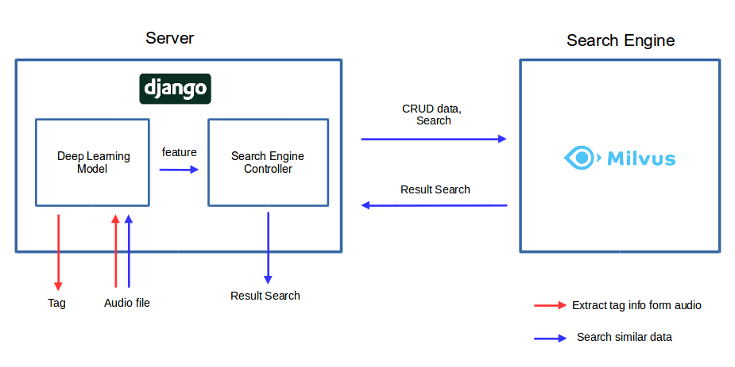

# 6th-lemorning-deep

6기 레모닝 딥러닝

## Install

- ffmpeg 설치

ubuntu
```
sudo apt-get update
sudo apt-get install ffmpeg
```

mac 
```
brew update
brew install ffmpeg
```

window는 아래 사이트 참고 : https://m.blog.naver.com/chandong83/221165275268

- python dependencies 설치

```
pip install -r requirements.txt
```

## Directory

```
.
├── data/
├── deep/
├── search_engine/
├── test_deep_model.py
├── test_search_engine.py
└── test_similarity.py

```

- data/ : 샘플 오디오나 미리 계산된 features 정보 저장
- deep/ : 오디오 데이터에서 tag나 feature을 추출하는 모델 저장
- search_engine/ : Milvus를 접근하기 위한 코드 저장
- test_deep_model.py : 오디오 데이터 추출하는 모델 사용 샘플 코드
- test_search_engine.py: Milvus 검색 엔진 사용 샘플 코드
- test_similarity.py: 유사도 계산하는 샘플 코드

## How to use

*1-1. features, tags 추출*

```
from deep.model import DeepModel

model = DeepModel()

path_audio = 'test.mp3'

# 1. get info (features, tags)
feats, tags = model.extract_info(path_audio, mode='both', topN=5)

# 2. get info (features)
feats = model.extract_info(path_audio, mode='feature')

# 3. get info (tags)
tags = model.extract_info(path_audio, mode='tag', topN=5)
```

*1-2. Request에서 features, tags 추출*

```
import io
from django.views import View

from deep.model import DeepModel

# 1. Django View Example
class Tag(View):
    def post(self, request):
        if request.FILES.get('file', ''):
            data = io.BytesIO(request.FILES['file'].file.read())

            model = DeepModel()
            feat, tag = model.extract_info(data)
```

*2. milvus 검색 엔진 사용*

```
from search_engine.milvusdb import SearchEngine

# 1. set engine
engine = SearchEngine('localhost', 19530)

##############################
# Collection
##############################
# 2-1. create collection
engine.create_collection('musicDB', 753)

# 2-2. show info of collection
engine.get_collection_stats('musicDB')

# 2-3. delete collection
engine.drop_collection('musicDB')

##############################
# CRUD Data
##############################
feature = model.extract_info(path_audio, mode='feature')
feature_new = model.extract_info(path_new_audio, mode='feature')

engine.create_collection('musicDB', 200)
engine.set_collection('musicDB')

# 3-1. insert data
engine.insert_data(0, feature)

# 3-2. delete data
engine.delete_data(0)

# 3-3. update data
engine.update_data(0, feature_new)

##############################
# Search Data
##############################

# 4-1. search data by feature
li_id, li_distance = engine.search_by_feature(feature, 5)

# 4-2. search data by key
li_id, li_distance = engine.search_by_key(0, 5)
```

## Environment



## Note

1. 빠른 오디오 로드를 위해서 음원의 6초가량의 첫부분만 사용.

2. 유사도 계산시에 분위기 보다는 사용되는 악기에 따른 유사도 측정됨

- MTT Dataset의 Label이 주로 악기나 장르로 정의 되어 있기 때문에

3. TAG는 MTT Dataset을 사용 (대략 50개)

```
tag = ['ambient', 'beat', 'beats', 'cello', 'choir', 'choral', 'classic', 'classical', 'country', 'dance', 'drums', 'electronic', 'fast', 'female', 'female vocal', 'female voice', 'flute', 'guitar', 'harp', 'harpsichord', 'indian', 'loud', 'male', 'male vocal', 'male voice', 'man', 'metal', 'new age', 'no vocal', 'no vocals', 'no voice', 'opera', 'piano', 'pop', 'quiet', 'rock', 'singing', 'sitar', 'slow', 'soft', 'solo', 'strings', 'synth', 'techno', 'violin', 'vocal', 'vocals', 'voice', 'weird', 'woman']
```

## Reference

- musicnn
  https://github.com/jordipons/musicnn/tree/516acb2a0ff5ef73f64547898e018e793152c506
